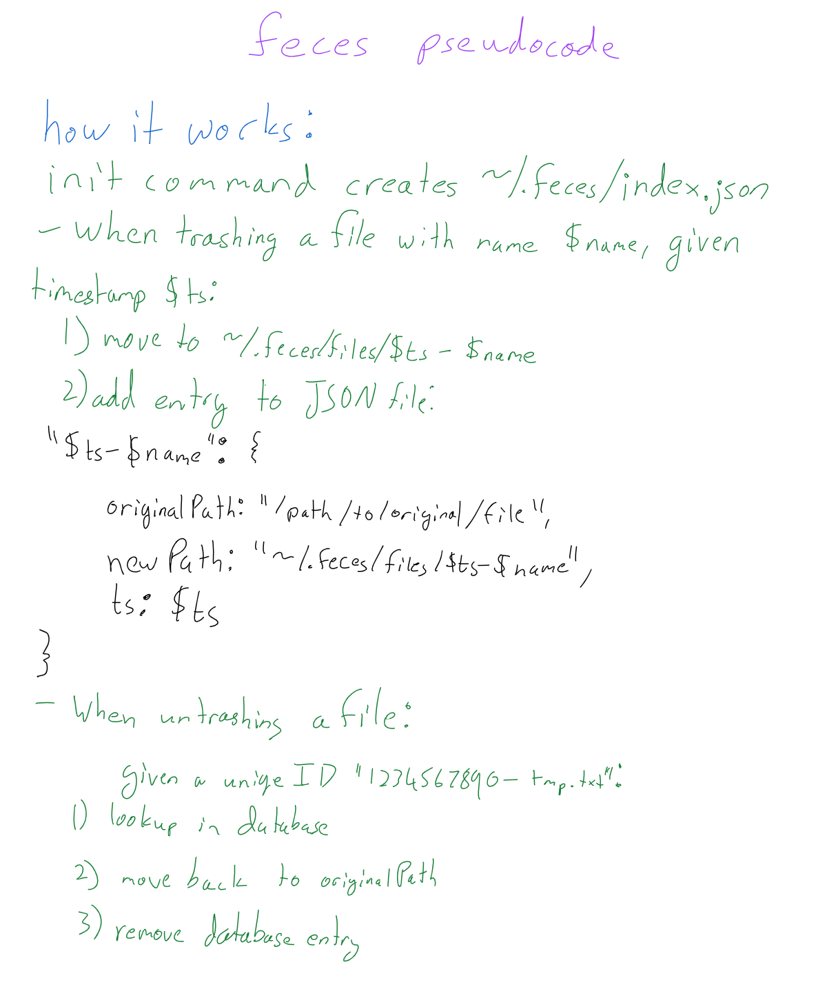

# feces-cli

A creatively named trash file manager built for the command line

---

## Installation

Install the npm package (`feces-cli`):

```bash
npm i -g feces-cli
```

It is recommended that you add one of the following to your `.bash_aliases` or `/bashrc`:

```bash
alias rm='feces plop'
alias rmf='\rm'
```

or the other way:

```bash
alias rmf='feces plop'
```

The CLI tool will be available via the `feces` command.

For available commands, run `feces help`.

## How it works


